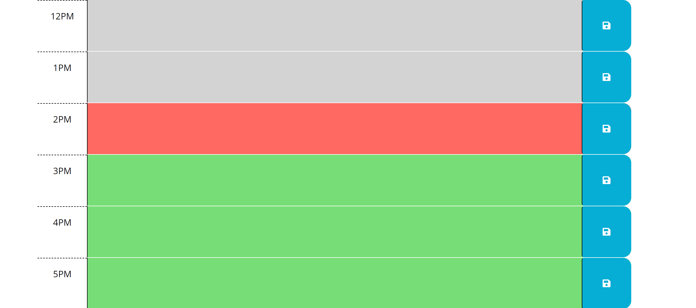

# YC-Calendar

# Purpose

Calendar allows user to see the current date and set to do lists from 9AM to 5PM. The user can type in the textarea and set thier schedule. Once their schdeul is typed in, they can save it by clicking on the icon on the right. If the time block hour has passed, then the text area will turn the color grey. If the time block hour is present, then the text area will turn to a red color. If the time block hour is in the future, then the text area will turn to a green color. This allows the user to see past, present and future time blocks.

# Usage 

Allows the user to schdeul in their to do list from 9 a.m. until 5 p.m.

# Files Included

* Javascript
* CSS
* HTML
* Readme
* Images

# Images

# Comment

The project was pushed up and that definetely helped in understading J query and 3rd party API's. This project helped me most in understanding HTML, localstorage and Javascript.